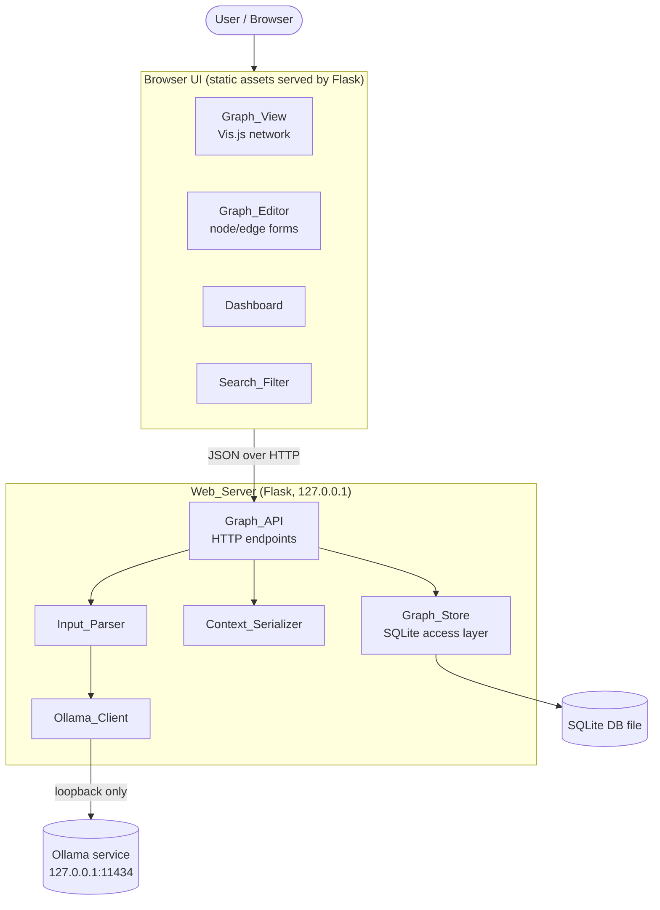
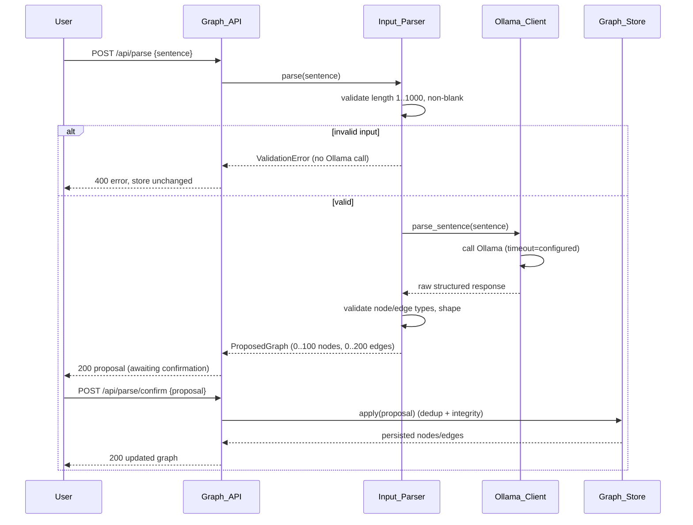
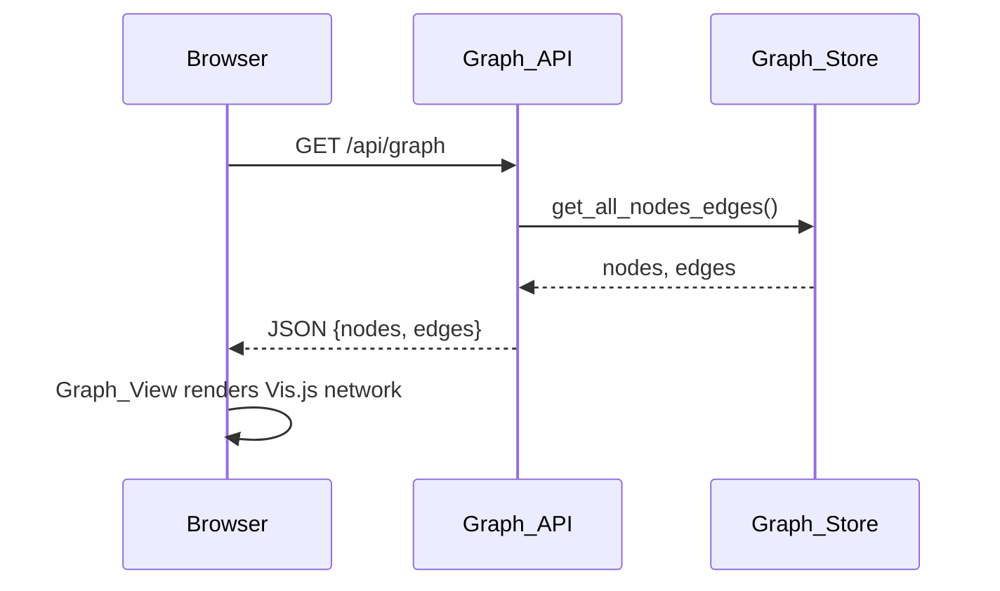
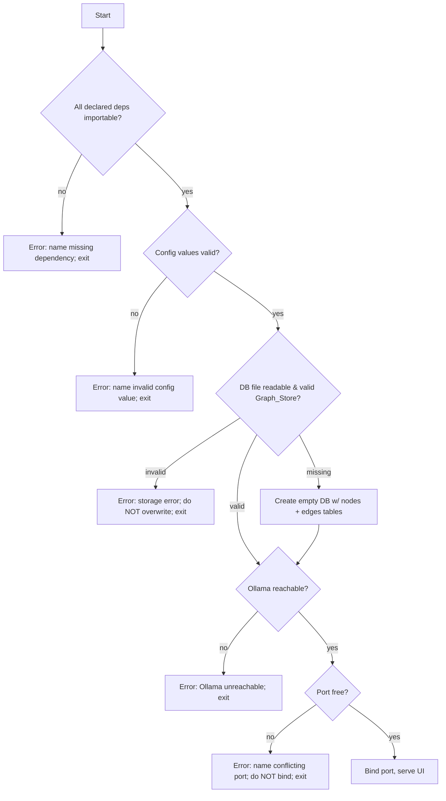

# Design Document

## Overview

LifeGraph is a fully local, single-user web application that models a person's life as a typed
property graph and serves it through a browser UI. The system is organized as a Python (Flask)
backend that exposes an HTTP `Graph_API`, a SQLite-backed `Graph_Store`, an `Input_Parser` that
turns natural-language sentences into proposed graph data through a locally running Ollama model,
a deterministic `Context_Serializer` for exporting subgraph snapshots, and a browser front end
(Graph_View, Graph_Editor, Dashboard, Search_Filter) built on Vis.js.

The design follows five load-bearing decisions established in the requirements:

1. **Human-in-the-loop parsing.** LLM output is non-deterministic, so the parser never writes
   directly. It returns a *proposal* that the user explicitly confirms or rejects before any
   persistence occurs (Req 3.5–3.7).
2. **Identity by normalized label + type.** Nodes are deduplicated on `(trim+casefold(label), type)`
   so repeated mentions converge on one node (Req 4).
3. **Cascade delete.** Deleting a node removes its incident edges so the store never holds dangling
   references (Req 5.5, 8.6).
4. **Two tables plus inline node attributes.** Nodes and edges live in two tables; each node carries
   an optional JSON attribute bag in the nodes table, which is what lets `Event` nodes hold a `date`
   for the dashboard without new tables (Req 5, 6).
5. **Deterministic, budgeted serialization.** Context export performs a bounded breadth-first walk
   and prioritizes by hop distance so the output is compact and reproducible (Req 10).

The whole system runs on the loopback interface only. The single external process it talks to is
the local Ollama service, and all language-model access is confined to one component
(`Ollama_Client`) so a different provider can be substituted later without touching the rest of the
system (Req 1, 16).

### Technology Choices

| Concern | Choice | Rationale |
| --- | --- | --- |
| Backend runtime | Python 3.10+ with Flask | Minimal dependency footprint; Req 2.3 wants Python + Ollama only. |
| Persistence | SQLite (stdlib `sqlite3`) | Single-file local store, zero-config, satisfies Req 1.5 / 5.1. |
| LLM access | Ollama HTTP API on `127.0.0.1:11434` | Local model execution, no cloud calls (Req 1, 14, 16). |
| Graph rendering | Vis.js Network | Required by Req 2.2 / 7.1; mature interactive network view. |
| Interchange format | Structured JSON | Required by Req 11; faithful backend↔browser exchange. |
| Node identifiers | UUIDv4 strings | Globally unique, stable across edits, never reused (Req 4.1). |

### Reconciled Requirement Details

Two requirement pairs overlap with slightly different numeric bounds. The design reconciles them
explicitly so implementation is unambiguous:

- **Attribute key/value length.** Req 5.2 states "at most 500 characters" while Req 6.1 states
  "1 to 255 characters." The design adopts the more specific dedicated-attributes rule: keys and
  values are validated to **1–255 characters**. The SQLite column itself imposes no narrower limit.
- **Node label length.** Req 5.2 allows a stored label of 1–200 characters (parser-produced labels),
  while Req 8.1 restricts a *manually entered* label to 1–100 characters. The design treats **1–200**
  as the storage/validation ceiling and **1–100** as the additional constraint enforced by the
  manual `Graph_Editor` entry path.

If either reconciliation conflicts with intent, the requirements phase should be revisited before
implementation.

## Architecture

### System Context



### Layering and Responsibilities

The backend is split into a thin transport layer and a logic core so the parts that benefit from
property-based testing stay pure and independently testable:

- **Transport layer (`Graph_API`, Flask routes).** Parses HTTP requests, invokes core components,
  serializes JSON responses, maps domain errors to HTTP status codes. Holds no business rules.
- **Logic core.**
  - `Graph_Store` — all persistence, identity/dedup rules, referential integrity, cascade delete.
  - `Input_Parser` — input validation, prompt construction, response validation into a proposal.
  - `Ollama_Client` — the sole gateway to the language model (Req 16).
  - `Context_Serializer` — pure subgraph traversal + text rendering, no I/O beyond reading the store.
- **Browser layer.** Renders state, gathers user input, calls the API. Contains no authoritative
  business rules; the backend remains the source of truth.

This separation directly supports modular AI access (Req 16): only `Input_Parser` depends on
`Ollama_Client`, and `Ollama_Client` exposes a single `parse_sentence(sentence) -> ProposedGraph`
interface, so swapping the provider is a one-component change.

### Request Lifecycles

**Natural-language ingestion (human-in-the-loop):**



A rejected proposal (`POST /api/parse/reject` or simply never confirmed) results in no write at all
(Req 3.7).

**Graph fetch / render:**



### Startup Sequence and Critical Conditions

At process start the `Web_Server` validates every critical startup condition before binding the
port; any failure stops startup with a specific error and serves no HTTP request (Req 2.4–2.6, 5.8,
15.3):



### Network Confinement

All outbound communication is restricted to loopback (Req 1.2, 1.4). The design enforces this by:

- Binding Flask to `127.0.0.1` only (never `0.0.0.0`).
- Configuring `Ollama_Client` with a fixed loopback base URL and validating, before each request,
  that the resolved host is a loopback address; a non-loopback target is blocked, no data is
  transmitted, and the API surfaces an "external connection prevented" indication.
- Performing no other network I/O anywhere in the codebase.

## Components and Interfaces

### Graph_API (Flask routes)

The API is the single HTTP surface. All responses are JSON except the root document. Errors use a
consistent envelope `{ "error": { "code": <string>, "message": <string>, "details": <object?> } }`
and appropriate HTTP status codes.

| Method & Path | Purpose | Success | Key errors |
| --- | --- | --- | --- |
| `GET /` | Serve HTML loading Vis.js + app JS (Req 2.2) | 200 HTML | — |
| `GET /api/graph` | Fetch full graph as JSON (Req 7.1, 11.1) | 200 `{nodes, edges}` | 500 storage |
| `POST /api/parse` | Validate + parse a sentence into a proposal (Req 3.1–3.4, 14) | 200 `ProposedGraph` | 400 validation, 422 unparseable, 502 ollama, 504 timeout |
| `POST /api/parse/confirm` | Persist a confirmed proposal (Req 3.6) | 200 `{nodes, edges}` | 400 invalid proposal, 500 storage |
| `POST /api/parse/reject` | Discard a proposal; no write (Req 3.7) | 204 | — |
| `POST /api/nodes` | Create node manually (Req 8.1) | 201 node | 400 validation |
| `PUT /api/nodes/{id}` | Edit node label/type/attributes (Req 6.2–6.4, 8.2) | 200 node | 400 validation, 404, 500 storage |
| `DELETE /api/nodes/{id}` | Delete node + cascade edges (Req 8.6) | 200 `{deletedEdgeIds}` | 404 |
| `GET /api/nodes/{id}/edges` | Count incident edges (drives delete warning, Req 8.7) | 200 `{count}` | 404 |
| `POST /api/edges` | Create edge (Req 9.1) | 201 edge | 400 validation, 409 referential, 422 self-edge |
| `PUT /api/edges/{id}` | Edit edge type (Req 9.2) | 200 edge | 400 validation, 404 |
| `DELETE /api/edges/{id}` | Delete edge, keep endpoints (Req 9.5) | 204 | 404 |
| `GET /api/dashboard` | Skills, goals, dated + undated events (Req 12) | 200 `{skills, goals, upcomingEvents, undatedEvents}` | 500 |
| `POST /api/context` | Context snapshot for a node (Req 10) | 200 `{snapshot}` | 404, 400 |
| `GET /api/search` | Filter by types and/or label term (Req 13) | 200 `{nodes, edges}` | 400 |

The delete-warning threshold (Req 8.7, "5 or more connected edges") is enforced in the browser by
calling `GET /api/nodes/{id}/edges` and requiring confirmation before issuing `DELETE`. The backend
delete is unconditional and idempotent once invoked; the confirmation gate is a UI responsibility,
and cancelling it issues no DELETE so the node and edges remain (Req 8.8).

### Graph_Store

The persistence and identity authority. Pure with respect to randomness except for ID generation,
which is injected so tests can supply deterministic IDs.

```python
class GraphStore:
    def __init__(self, db_path: str, id_factory: Callable[[], str] = uuid4_str): ...

    # Reads
    def get_graph(self) -> Graph: ...                      # all nodes + edges
    def get_node(self, node_id: str) -> Node | None: ...
    def find_node(self, label: str, type: NodeType) -> Node | None:  # by normalized identity
    def incident_edges(self, node_id: str) -> list[Edge]: ...
    def nodes_by_type(self, types: set[NodeType]) -> list[Node]: ...

    # Writes (each is a single transaction)
    def upsert_node(self, label: str, type: NodeType,
                    attributes: dict[str, str] | None = None) -> Node: ...
    def update_node(self, node_id: str, *, label=None, type=None,
                    attributes=None) -> Node: ...
    def delete_node(self, node_id: str) -> list[str]:       # returns deleted edge ids (cascade)
    def create_edge(self, source_id: str, target_id: str, type: EdgeType) -> Edge: ...
    def update_edge(self, edge_id: str, type: EdgeType) -> Edge: ...
    def delete_edge(self, edge_id: str) -> None: ...

    # Proposal application (dedup-aware, single transaction)
    def apply_proposal(self, proposal: ProposedGraph) -> Graph: ...
```

Identity and integrity rules implemented here:

- **Deduplication (Req 4.2–4.5):** `upsert_node` computes `normalized = label.strip()` compared
  case-insensitively (Unicode casefold). If a node with the same `(normalized, type)` exists, it is
  reused — its id, stored label, and existing attributes are left unchanged. Otherwise a new node
  with a fresh UUID is created. A uniqueness index on `(normalized_label, type)` enforces this at the
  storage layer.
- **Edge endpoint resolution (Req 4.4):** when applying a proposal, edges reference nodes by
  `(label, type)`; the store resolves or creates each endpoint node first, then creates the edge.
- **Referential integrity (Req 5.4):** `create_edge` rejects any edge whose source or target id is
  absent, reporting the missing id and leaving both tables unchanged. Enforced by a `FOREIGN KEY`
  with the insert wrapped in a transaction.
- **Cascade delete (Req 5.5, 8.6):** `delete_node` deletes incident edges in the same transaction,
  via `ON DELETE CASCADE`, and returns the removed edge ids.
- **Stable, non-reused ids (Req 4.1):** ids are UUIDv4 strings generated by `id_factory`, never
  derived from mutable fields and never recycled.

### Input_Parser

```python
class InputParser:
    def __init__(self, ollama: OllamaClient,
                 node_types: frozenset[str], edge_types: frozenset[str]): ...

    def parse(self, sentence: str) -> ProposedGraph:
        """
        Validates input, then delegates to Ollama, then validates the response shape.
        Raises:
          InputValidationError  - empty/blank/>1000 chars (no Ollama call) [Req 3.8]
          UnparseableResponse    - response not convertible to nodes/edges  [Req 3.4]
          InvalidTypeError       - node/edge type outside the allowed sets  [Req 3.3]
          OllamaUnavailableError - service down / model missing / error     [Req 14.1, 14.2]
          OllamaTimeoutError     - exceeded configured timeout              [Req 3.9, 14.4]
        On any raised error the caller performs no write (store unchanged).
        """
```

Validation order matters: length/blank checks run **before** any Ollama contact (Req 3.8). Type
validation rejects only the offending element while reporting the invalid type (Req 3.3); the
parser caps output at 100 nodes / 200 edges (Req 3.2).

### Ollama_Client (sole LLM gateway, Req 16)

```python
class OllamaClient:
    def __init__(self, base_url: str, model: str, timeout_seconds: int = 60): ...
    def parse_sentence(self, sentence: str) -> RawProposal:
        """Single defined interface for sentence -> structured graph data (Req 16.3).
        Verifies base_url is loopback before connecting (Req 1.2/1.4).
        Raises OllamaUnavailableError / OllamaTimeoutError with actionable messages."""
```

This is the only component permitted to perform language-model communication (Req 16.1, 16.2). It
distinguishes "service unreachable," "model not installed" (Req 14.2), and "timeout" (Req 14.4,
default 60s) so the UI can give targeted guidance.

### Context_Serializer

```python
class ContextSerializer:
    def __init__(self, max_hops: int = 2, max_nodes: int = 50, max_chars: int = 4000): ...
    def serialize(self, graph: Graph, root_id: str) -> str:
        """Deterministic BFS from root_id up to max_hops; trims by ascending hop distance
        when over budget; renders plain text. Pure function of (graph, root_id, config)."""
```

Determinism (Req 10.5) is guaranteed by ordering every traversal step by a stable key
(hop distance, then node id) and by rendering with a fixed template — no clock, randomness, or
dict-iteration-order dependence. Budget trimming retains nearer nodes and drops the most distant
(Req 10.4). Output includes each node's type+label and each edge's type, source, and target
(Req 10.2) as plain text (Req 10.6).

### Browser Components

- **Graph_View** — fetches `GET /api/graph`, builds a Vis.js `Network`. Per-type node styling
  (color/shape) gives each `Node_Type_Set` member a distinct look (Req 7.7); node labels and
  edge-type labels are shown (Req 7.2, 7.3). Selecting a node highlights it and its incident edges
  (Req 7.4). Re-renders whenever the store changes via create/edit/delete (Req 7.5). Renders an
  empty network cleanly when there are no nodes (Req 7.8) and shows an error with no partial network
  if the fetch fails (Req 7.9).
- **Graph_Editor** — node and edge create/edit/delete forms; performs client-side validation
  mirroring backend rules for immediate feedback and preserves submitted values on rejection
  (Req 8.3–8.5). Drives the high-degree delete confirmation (Req 8.7).
- **Dashboard** — calls `GET /api/dashboard`; lists all Skills and Goals, upcoming events sorted by
  ascending date (today counts as upcoming), and an undated-events group (Req 12).
- **Search_Filter** — composes type filters and a label term into `GET /api/search`; clearing
  restores the full graph; results are handed to Graph_View to render (Req 13).

## Data Models

### Domain Types

```
NodeType  = Skill | Goal | Habit | Project | Event | Person | Resource          # Node_Type_Set
EdgeType  = requires | supports | conflicts_with | motivated_by | leads_to
          | part_of | owned_by | blocks | related_to                            # Edge_Type_Set

Node = {
    id:         string (UUIDv4, unique, stable, never reused)        # Req 4.1
    type:       NodeType
    label:      string, 1..200 chars stored (manual entry: 1..100)  # Req 5.2 / 8.1
    attributes: map<string,string>, 0..50 entries,
                each key & value 1..255 chars                        # Req 5.2/6.1 (reconciled)
}

Edge = {
    id:      string (UUIDv4, unique)
    source:  string (existing Node.id)                               # Req 5.3
    target:  string (existing Node.id, target != source)            # Req 9.4
    type:    EdgeType
}

Graph         = { nodes: Node[], edges: Edge[] }
ProposedGraph = { nodes: ProposedNode[], edges: ProposedEdge[] }     # endpoints by (label,type)
```

A `ProposedNode`/`ProposedEdge` is the pre-confirmation shape produced by the `Input_Parser`. Edges
in a proposal reference their endpoints by `(label, type)` rather than id, because ids are assigned
only at persistence time after deduplication (Req 4.4).

### Normalized Identity

```
normalize(label) = casefold(strip(label))
identity(node)   = ( normalize(node.label), node.type )
```

Two nodes are the same node iff their identities are equal (Req 4.5). The stored label preserves the
user's original casing/whitespace-trimmed text; only the comparison is normalized.

### SQLite Schema

```sql
PRAGMA foreign_keys = ON;

CREATE TABLE IF NOT EXISTS nodes (
    id              TEXT PRIMARY KEY,                 -- UUIDv4
    type            TEXT NOT NULL CHECK (type IN (
                        'Skill','Goal','Habit','Project','Event','Person','Resource')),
    label           TEXT NOT NULL CHECK (length(label) BETWEEN 1 AND 200),
    normalized_label TEXT NOT NULL,                   -- casefold(trim(label))
    attributes      TEXT NOT NULL DEFAULT '{}',       -- JSON object of key->value strings
    UNIQUE (normalized_label, type)                   -- dedup identity (Req 4.2/4.5)
);

CREATE TABLE IF NOT EXISTS edges (
    id        TEXT PRIMARY KEY,                        -- UUIDv4
    source_id TEXT NOT NULL REFERENCES nodes(id) ON DELETE CASCADE,  -- Req 5.4/5.5
    target_id TEXT NOT NULL REFERENCES nodes(id) ON DELETE CASCADE,
    type      TEXT NOT NULL CHECK (type IN (
                  'requires','supports','conflicts_with','motivated_by','leads_to',
                  'part_of','owned_by','blocks','related_to')),
    CHECK (source_id <> target_id)                     -- no self-edges (Req 9.4)
);

CREATE INDEX IF NOT EXISTS idx_nodes_type ON nodes(type);          -- dashboard/filter
CREATE INDEX IF NOT EXISTS idx_edges_source ON edges(source_id);
CREATE INDEX IF NOT EXISTS idx_edges_target ON edges(target_id);
```

Notes:

- **Attributes as JSON in the nodes table** keeps the two-table model while supporting optional
  per-node detail such as an `Event.date` (Req 5.2, 6.1). Attribute count (≤50) and per-key/value
  length (1–255) are validated in the `Graph_Store` before write, since SQLite cannot express the
  per-entry constraint on a JSON blob.
- **`ON DELETE CASCADE`** implements cascade delete at the storage layer (Req 5.5); the store still
  returns the removed edge ids for the API response.
- **Foreign keys** give referential integrity (Req 5.4); inserts run inside a transaction so a
  rejected edge leaves both tables unchanged.
- On first start with no file, the schema is created empty (Req 5.7). If the file exists but is not
  a valid Graph_Store database, startup stops without overwriting it (Req 5.8).

### Event Date Attribute

`Event` nodes may carry a `date` attribute in `YYYY-MM-DD` form. Validation requires both the format
and a real calendar date (valid month and day), e.g. `2025-02-30` is rejected (Req 6.2, 6.3). The
dashboard treats an event as "upcoming" when `date >= today` (today included regardless of time of
day) and groups date-less events separately (Req 12.2, 12.3).

### JSON Interchange Shape

`GET /api/graph` returns exactly:

```json
{
  "nodes": [
    { "id": "…", "type": "Skill", "label": "Guitar", "attributes": { } }
  ],
  "edges": [
    { "id": "…", "source": "…", "target": "…", "type": "requires" }
  ]
}
```

Every node carries id, type, label, attributes and every edge carries id, source, target, type
(Req 11.2). Deserializing this document reproduces a node/edge set equivalent to the store contents
at serialization time (Req 11.3, round-trip).

## Correctness Properties

*A property is a characteristic or behavior that should hold true across all valid executions of a
system — essentially, a formal statement about what the system should do. Properties serve as the
bridge between human-readable specifications and machine-verifiable correctness guarantees.*

The properties below were derived from the acceptance-criteria prework and consolidated to remove
redundancy (for example, the cascade-delete invariant appears in both Req 5.5 and 8.6 and is stated
once; the normalization rule in Req 4.5 is folded into the deduplication property). Each property is
universally quantified and intended to be implemented by a single property-based test.

### Property 1: Loopback guard classification

*For any* network target address, the loopback guard SHALL permit the connection if and only if the
address resolves to a loopback address, and SHALL block every non-loopback target without
transmitting data.

**Validates: Requirements 1.4**

### Property 2: Length and blank-input gating of the parser

*For any* input string, the `Input_Parser` SHALL contact the `Ollama_Client` exactly once when the
string is non-blank and 1–1000 characters long, and SHALL reject the input without contacting the
`Ollama_Client` (leaving the `Graph_Store` unchanged) when the string is empty, all-whitespace, or
longer than 1000 characters.

**Validates: Requirements 3.1, 3.8**

### Property 3: Proposal bounds and type validity

*For any* well-formed model response, the produced `ProposedGraph` SHALL contain between 0 and 100
nodes and between 0 and 200 edges, and every proposed node type SHALL be a member of the
Node_Type_Set and every proposed edge type a member of the Edge_Type_Set.

**Validates: Requirements 3.2**

### Property 4: Invalid type rejection

*For any* model response containing a node type outside the Node_Type_Set or an edge type outside
the Edge_Type_Set, the `Input_Parser` SHALL reject the offending element and report a validation
error that names the invalid type.

**Validates: Requirements 3.3**

### Property 5: Unparseable response leaves store unchanged

*For any* model response that cannot be converted into nodes and edges, the `Input_Parser` SHALL
raise a descriptive error and the `Graph_Store` node set and edge set SHALL be unchanged.

**Validates: Requirements 3.4**

### Property 6: Confirm persists, reject is a no-op

*For any* `Graph_Store` state and any valid proposal, confirming the proposal SHALL result in a
store whose nodes and edges include every proposed node (after deduplication) and every proposed
edge, while rejecting the same proposal SHALL leave the store's node set and edge set identical to
their pre-proposal values.

**Validates: Requirements 3.6, 3.7**

### Property 7: Node identity is unique, stable, and never reused

*For any* sequence of node create, edit, and delete operations, every live node SHALL have an
identifier unique among all nodes, each node's identifier SHALL remain unchanged across edits to its
label, type, or attributes, and no identifier belonging to a deleted node SHALL be assigned to a
later node.

**Validates: Requirements 4.1**

### Property 8: Deduplication by normalized label and type

*For any* two node-creation requests, the `Graph_Store` SHALL reuse a single node (preserving its
identifier, stored label, and existing attributes) when the requests share both their normalized
label (trimmed, case-insensitive) and their type, and SHALL otherwise create two distinct nodes with
distinct identifiers.

**Validates: Requirements 4.2, 4.3, 4.5**

### Property 9: Edge endpoints resolve to identity-matched nodes

*For any* proposal, after it is applied every resulting edge's source and target SHALL reference
nodes whose normalized label and type match the edge's referenced endpoints, reusing a pre-existing
identity-matched node when one exists and creating it beforehand when none exists.

**Validates: Requirements 4.4**

### Property 10: Referential integrity on edge creation

*For any* `Graph_Store` state and any edge whose source or target identifier is absent from the nodes
table, edge creation SHALL be rejected with an error identifying the missing identifier, and the
nodes table and edges table SHALL be unchanged.

**Validates: Requirements 5.4**

### Property 11: Cascade delete removes all incident edges

*For any* graph and any node in it, deleting that node SHALL remove the node and every edge whose
source or target is that node, while leaving all other nodes and all non-incident edges unchanged.

**Validates: Requirements 5.5, 8.6**

### Property 12: Storage reload round-trip

*For any* graph, writing it to the `Graph_Store`, closing, and reopening the database SHALL yield a
node set and edge set equal field-for-field to the graph that was written.

**Validates: Requirements 5.6**

### Property 13: Node and attribute validation bounds

*For any* node-write request, the `Graph_Store` SHALL accept it when the label is 1–200 characters
and the attribute set has at most 50 entries each with a key and value of 1–255 characters, and SHALL
reject it (leaving stored data unchanged) when any of those bounds is violated.

**Validates: Requirements 5.2, 6.1**

### Property 14: Event date validation and persistence

*For any* string assigned to an `Event` node's `date` attribute, the `Graph_Editor` SHALL store the
value when it is a real calendar date in `YYYY-MM-DD` form, and SHALL reject it while leaving the
node's previously stored attributes unchanged when it is not a valid `YYYY-MM-DD` calendar date.

**Validates: Requirements 6.2, 6.3**

### Property 15: Attribute edit round-trip

*For any* node and any valid attribute map, after the attributes are edited a read of that node by
its identifier SHALL return exactly the written attribute map.

**Validates: Requirements 6.4**

### Property 16: Graph-to-view transform preserves labels

*For any* graph, the Vis.js dataset transform SHALL produce exactly one item per node carrying that
node's label and exactly one item per edge carrying a label equal to its edge type.

**Validates: Requirements 7.2, 7.3**

### Property 17: Node type styling is injective

*For any* two distinct node types in the Node_Type_Set, the node-style mapping SHALL assign visually
distinct styles.

**Validates: Requirements 7.7**

### Property 18: Manual node label and type validation

*For any* manual node submission, the `Graph_Editor` SHALL create the node when its trimmed label is
1–100 characters and its type is in the Node_Type_Set, and SHALL otherwise reject the submission
(retaining the submitted values and leaving the `Graph_Store` unchanged) when the type is invalid,
the trimmed label is empty, or the trimmed label exceeds 100 characters.

**Validates: Requirements 8.1, 8.3, 8.4, 8.5**

### Property 19: High-degree delete warning threshold

*For any* node, the `Graph_Editor` SHALL require a delete confirmation warning if and only if the
node has 5 or more connected edges.

**Validates: Requirements 8.7**

### Property 20: Edge creation and type validation

*For any* edge submission, the `Graph_Editor` SHALL create the edge when its source and target are
distinct existing nodes and its type is in the Edge_Type_Set, and SHALL reject it (leaving the
`Graph_Store` unchanged) when the type is not in the Edge_Type_Set or the source and target are the
same node.

**Validates: Requirements 9.1, 9.3, 9.4**

### Property 21: Edge type edit round-trip

*For any* edge and any type in the Edge_Type_Set, after the edge's type is updated a read of that edge
SHALL return the new type with its source and target unchanged.

**Validates: Requirements 9.2**

### Property 22: Edge deletion preserves endpoints

*For any* graph and any edge in it, deleting that edge SHALL remove only that edge and SHALL leave its
source and target nodes and all other edges present.

**Validates: Requirements 9.5**

### Property 23: Context snapshot content completeness

*For any* graph and selected root node, the context snapshot SHALL contain, for every included node,
its type and label, and for every included edge, its type, source, and target.

**Validates: Requirements 10.2**

### Property 24: Context traversal respects the hop bound

*For any* graph, root node, and maximum hop distance, every node included in the snapshot SHALL have a
shortest-path distance from the root no greater than the maximum hop distance.

**Validates: Requirements 10.3**

### Property 25: Context budget prioritizes nearer nodes

*For any* graph whose subgraph exceeds the configured node or character budget, the included node set
SHALL stay within budget and SHALL be ordered by ascending hop distance such that whenever a node at
distance d is omitted, no node at distance greater than d is included.

**Validates: Requirements 10.4**

### Property 26: Context serialization is deterministic

*For any* graph, root node, and serialization parameters, two invocations of the `Context_Serializer`
SHALL produce identical snapshot strings.

**Validates: Requirements 10.5**

### Property 27: JSON interchange round-trip

*For any* graph, deserializing the JSON document produced by the `Graph_API` SHALL yield a node set
and edge set equivalent to the `Graph_Store` contents at serialization time, with every node's
identifier, type, label, and attributes and every edge's identifier, source, target, and type
preserved.

**Validates: Requirements 11.1, 11.2, 11.3**

### Property 28: Dashboard skill and goal completeness

*For any* graph, the dashboard's skills list SHALL equal exactly the nodes of type `Skill` and its
goals list SHALL equal exactly the nodes of type `Goal`.

**Validates: Requirements 12.1**

### Property 29: Dashboard event partitioning and ordering

*For any* set of `Event` nodes and any reference date "today", the dashboard's upcoming-events list
SHALL equal exactly the events whose `date` is today or later, sorted in ascending date order, and its
undated-events group SHALL equal exactly the events with no `date` attribute, the two groups being
disjoint.

**Validates: Requirements 12.2, 12.3**

### Property 30: Type and label filtering with order independence

*For any* graph, any selected set of node types, and any label search term, the `Search_Filter` result
SHALL contain exactly the nodes whose type is in the selected set (when a type filter is active) and
whose label contains the term under case-insensitive matching (when a term is active) together with
the edges connecting two included nodes; the result SHALL be identical regardless of the order in
which the filters were applied; and when no filter or term is active the result SHALL be all nodes and
edges.

**Validates: Requirements 13.1, 13.2, 13.3, 13.4**

### Property 31: Configuration defaulting

*For any* subset of provided configuration settings, the merged configuration SHALL use each provided
value where given and the documented default for every omitted setting.

**Validates: Requirements 15.2**

## Error Handling

Errors are modeled as a small hierarchy of domain exceptions in the logic core. The `Graph_API`
maps each to an HTTP status and the standard error envelope
`{ "error": { "code", "message", "details? } }`. The principle throughout is **fail closed**: on any
error in a write path, the `Graph_Store` is left unchanged.

| Domain error | Source | HTTP | Requirement |
| --- | --- | --- | --- |
| `InputValidationError` | blank / >1000-char sentence | 400 | 3.8 |
| `InvalidTypeError` | node/edge type outside allowed set | 400 | 3.3, 8.3, 9.3 |
| `UnparseableResponse` | model output not convertible | 422 | 3.4 |
| `OllamaUnavailableError` | service down or model missing | 502 | 14.1, 14.2 |
| `OllamaTimeoutError` | request exceeded timeout | 504 | 3.9, 14.4 |
| `LabelValidationError` | empty / too-long label | 400 | 8.4, 8.5 |
| `DateValidationError` | invalid `Event.date` | 400 | 6.3 |
| `SelfEdgeError` | source == target | 422 | 9.4 |
| `ReferentialIntegrityError` | edge endpoint id missing | 409 | 5.4 |
| `NotFoundError` | unknown node/edge id | 404 | 6.x, 8.x, 9.x |
| `StorageError` | DB read/write failure | 500 | 6.5 |
| `ExternalConnectionBlocked` | non-loopback target attempted | 502 | 1.4 |

**Startup failures (Req 2.4–2.6, 5.8, 15.3).** Validated before binding the port; each aborts startup
with a message naming the specific failed condition (missing dependency, busy port, unreachable
Ollama, invalid config value, or unreadable/invalid database) and serves no HTTP request. An
unreadable or invalid existing database is never overwritten (Req 5.8).

**Write-path atomicity (Req 3.4, 3.9, 5.4, 6.5).** Each write is a single SQLite transaction.
Validation runs before the transaction; a referential-integrity violation or a mid-write storage
failure rolls back so node and edge sets are unchanged and the failure is reported to the user.

**Parsing feedback (Req 14.3).** While a parse request is in flight, the `Graph_API` returns/streams
an "in progress" indication so the UI can show progress; unreachable, missing-model, and timeout
conditions produce distinct, actionable messages.

**Graph fetch failure (Req 7.9).** If the browser cannot fetch graph data on load, the Graph_View
shows an error indication and renders no partial network.

## Testing Strategy

The system uses a dual approach: **property-based tests** for the universal correctness properties
above, and **example/integration/smoke tests** for specific scenarios, external wiring, and one-time
setup that are not amenable to property testing.

### Property-Based Testing

- **Library:** [Hypothesis](https://hypothesis.readthedocs.io/) for Python (the backend logic core).
  The front-end pure transforms (Properties 16, 17) are tested with
  [fast-check](https://fast-check.dev/) under the browser test runner. Property-based testing is not
  implemented from scratch.
- **Iterations:** each property test runs a minimum of 100 generated examples
  (`@settings(max_examples=100)` in Hypothesis; `{ numRuns: 100 }` in fast-check).
- **Tagging:** each property test is tagged with a comment referencing its design property in the
  form **Feature: lifegraph, Property {number}: {property_text}**.
- **One test per property:** each of Properties 1–31 is implemented by a single property-based test.
- **Generators:**
  - *Nodes* — random type from the Node_Type_Set, labels including whitespace-padded and mixed-case
    variants (to exercise normalization), and attribute maps spanning the size/length boundaries.
  - *Graphs* — random node sets followed by random edges drawn only between existing nodes (avoiding
    self-edges), plus deliberately malformed variants for error-path properties.
  - *Proposals* — random proposed nodes/edges with endpoints referenced by `(label, type)`, including
    duplicates and pre-existing matches to exercise deduplication.
  - *Dates* — valid `YYYY-MM-DD` calendar dates and invalid strings (bad format and impossible dates
    such as `2025-02-30`) for the Event-date property.
  - *Ollama responses* — a fake `Ollama_Client` returns generated raw responses (well-formed,
    type-invalid, and unparseable) so parser properties run without the real service.
  - *Config* — random subsets of provided/omitted settings for the defaulting property.
- **Determinism aids:** `id_factory` is injected so tests can supply deterministic identifiers, and
  the `Context_Serializer` and dashboard accept an injected "today"/clock to keep date-dependent
  properties reproducible.

### Example, Integration, and Smoke Tests

These cover criteria the prework classified as EXAMPLE, EDGE_CASE, INTEGRATION, or SMOKE:

- **Endpoint examples:** root returns HTML loading Vis.js + app JS (2.2); edge field read-back (5.3);
  empty-store render (7.8); fetch-failure error indication (7.9); cancel-delete keeps data (8.8);
  dashboard freshness on reload (12.4); filter/clear re-render (13.5).
- **Error-path examples (mocked Ollama / fault injection):** parse timeout (3.9); Ollama unavailable
  (14.1) and missing model (14.2); parsing-in-progress indication (14.3); timeout abort (14.4);
  store-unavailable during attribute edit (6.5); proposal presented before any write (3.5).
- **Startup examples:** missing dependency (2.4); port in use (2.5); each critical condition (2.6);
  new empty DB created when absent (5.7); invalid/unreadable DB not overwritten (5.8); invalid config
  value named (15.3); config values loaded (15.1).
- **Integration tests (1–3 examples each):** server serves on configured/default port (2.1); UI
  renders seeded data as a Vis.js network (7.1); store change reflected in view (7.5); selection
  highlight (7.4).
- **Performance test:** initial render within 3 seconds for up to 500 nodes / 1000 edges on the
  reference development machine (7.6).
- **Smoke / architecture checks:** no credentials required to run (1.1); single SQLite file (1.5,
  5.1); loopback-only binding and Ollama base URL (1.2); offline operation (1.3); dependency footprint
  (2.3); LLM access confined to `Ollama_Client` with its single interface (16.1, 16.2, 16.3).

### Coverage Notes

Every acceptance criterion maps to at least one test. Criteria expressing architectural intent
(Req 16) or operational/offline guarantees (Req 1.1, 1.3) are validated by smoke and
dependency/architecture checks rather than property tests, consistent with the guidance that PBT is
inappropriate for configuration, wiring, and side-effect-only concerns.
